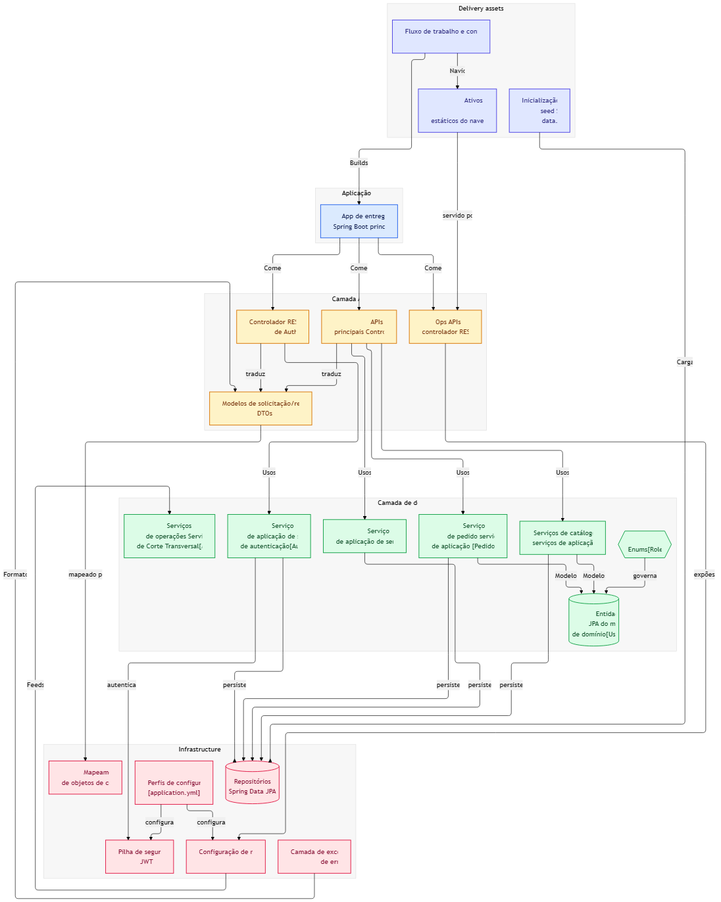

# DELIVERY TECH API

Uma API de delivery desenvolvida com **Java 21** e **Spring Boot 3.4.x**. O projeto aplica conceitos  de **Arquitetura em Camadas** e boas práticas de desenvolvimento de software.

# Arquitetura do Sistema

O projeto foi estruturado seguindo o padrão de **Arquitetura em Camadas (Layered Architecture)**, garantindo a separação de responsabilidades, facilidade de manutenção e isolamento do código:

* **Camada de Apresentação (`Controller`):** Responsável por expor os endpoints REST da API e receber as requisições HTTP do cliente.
* **Camada de Negócio (`Service`):** Onde residem as regras de negócio do sistema (validações, cálculos e fluxos de entrega).
* **Camada de Acesso a Dados (`Repository`):** Interface de comunicação direta com o banco de dados utilizando Spring Data JPA.
* **Camada de Configuração (`Config`):** Centraliza as definições de segurança (JWT), monitoramento e infraestrutura.
Tecnologias e Stack Utilizada

 Infraestrutura

* **Java 21 (LTS):** Utilização de recursos modernos da linguagem para maior performance.
* **Spring Boot 3.4.x:** Framework base para inicialização e gerenciamento do ecossistema.
* **Maven:** Gerenciador de dependências e automação de builds pelo terminal.

 Persistência & Performance

* **Spring Data JPA / Hibernate:** Abstração completa da camada de banco de dados.
* **H2 Database:** Banco de dados em memória de alta velocidade para o ambiente de desenvolvimento.
* **Spring Boot Cache & Redis:** Estratégia de cache distribuído para aceleração de respostas e economia de memória.

Segurança & Validação

* **Spring Security:** Controle de autenticação e autorização robusto.
* **JSON Web Tokens (JWT):** Emissão e validação de tokens para rotas protegidas.
* **Spring Validation:** Validação rigorosa dos dados de entrada nas requisições.

Observabilidade & Monitoramento

* **Spring Boot Actuator:** Indicadores automáticos de saúde do sistema (`/health`).
* **Micrometer & Prometheus:** Coleta de métricas, contadores de requisições e monitoramento de performance.
* **Brave & Zipkin:** Rastreamento distribuído (telemetria) de requisições de ponta a ponta.

Desenvolvedor
Flavio Santana - Desenvolvedor Principal

## DIAGRAMA DO PROJETO

O diagrama abaixo ilustra como os componentes se comunicam, desde a requisição do cliente até a persistência dos dados:

Explicando arquitetura em camadas

Diagrama

Divisão das Camadas
Delivery Assets / Frontend (Camada de Apresentação): Gerencia o fluxo de trabalho e serve os ativos estáticos que interagem com o ecossistema.

Camada de Controladores (API REST): Porta de entrada da aplicação. Recebe as requisições HTTP, valida os dados utilizando DTOs (Data Transfer Objects) e direciona as chamadas para as regras de negócio corretas.

Camada de Serviços (Service Layer & Domínio): Onde reside o "coração" da aplicação. Processa as regras de negócio, gerencia a segurança/autenticação e manipula as Entidades de Domínio (JPA).

Camada de Infraestrutura: Responsável pelo suporte operacional do sistema. Inclui a configuração do banco de dados com Spring Data JPA, configurações globais (application.yml), mapeamento de objetos, tratamento global de exceções e a pilha de segurança via JWT (JSON Web Token).
